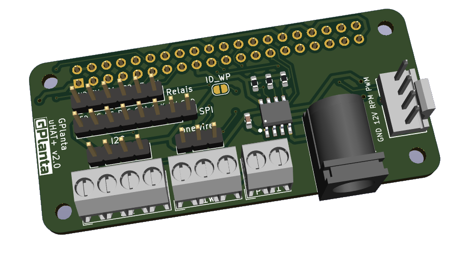
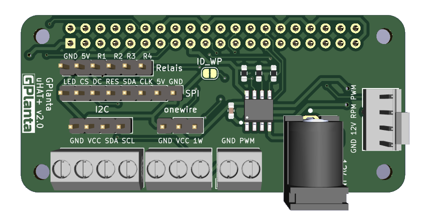
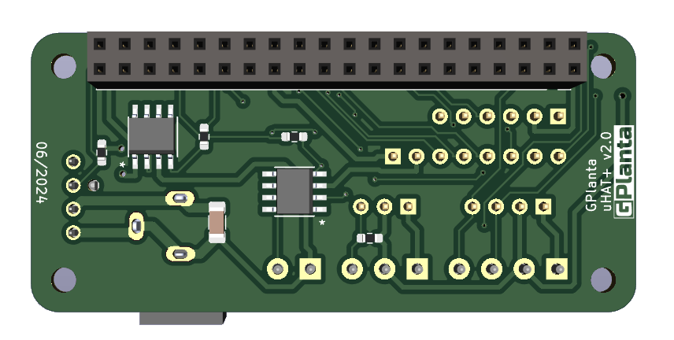

# gplanta_raspizero_hat

## Overview

This project is a Raspberry Pi Zero Sensor and PWM uHAT.
Python App coming soon.

## Features

- **ONEWIRE**: Connect ONEWIRE Sensors.
- **I2C**: Connect I2C Sensors.
- **PWM**: Control 2 PWM signals. PWM1 only GND/PWM. PWM2 with 12V DC input and rpm readout.
- **RELAIS**: Connect 4 Relais.
- **SPI**: Connect a SPI Display.

## BOM

- 3x	1k Resistor 0603
- 1x	3k3 Resistor 0603
- 2x	3.9k Resistor 0603
- 1x	4k7 Resistor 0603
- 1x	100n Capacitor 0603
- 1x	680uF Capacitor 1206
- 1x	CAT24C256
- 1x	PJ-102A
- 2x	IRF7319TRPBF
- 1x	CONN_47053-1000_MOL
- 1x	PinHeader_1x08_P2.54mm_Vertical
- 1x	PinHeader_1x04_P2.54mm_Vertical
- 1x	PinHeader_1x06_P2.54mm_Vertical
- 1x	PinHeader_1x03_P2.54mm_Vertical
- 1x	PinSocket_2x20_P2.54mm_Vertical
- 1x	TerminalBlock_MetzConnect_Type059_RT06302HBWC_1x02_P3.50mm_Horizontal
- 1x	TerminalBlock_MetzConnect_Type059_RT06303HBWC_1x03_P3.50mm_Horizontal
- 1x	TerminalBlock_MetzConnect_Type059_RT06304HBWC_1x04_P3.50mm_Horizontal

## PCB Overview
Side:

Front:

Back:

